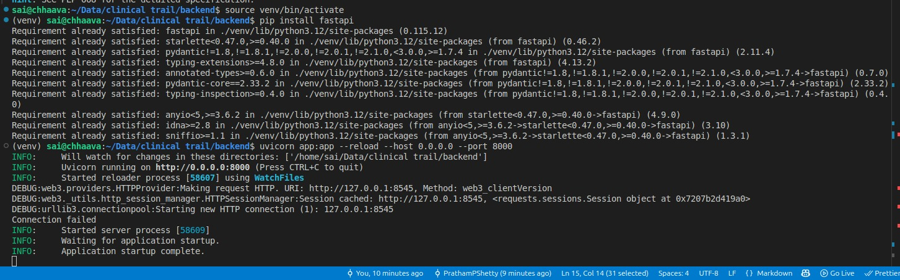
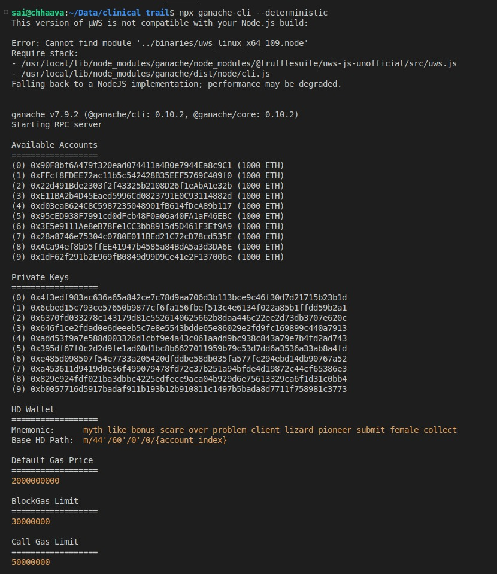
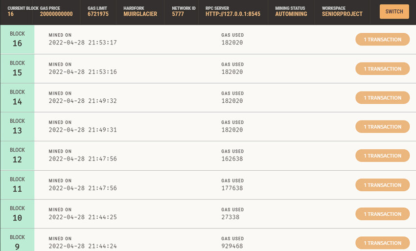
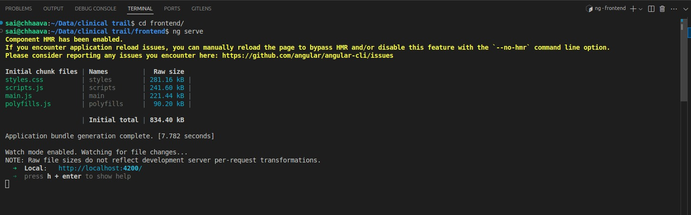
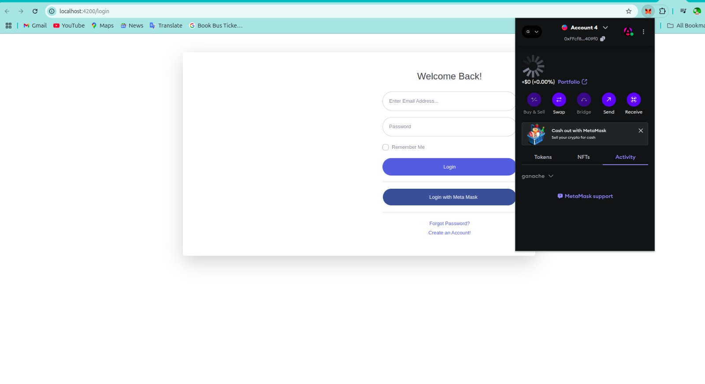
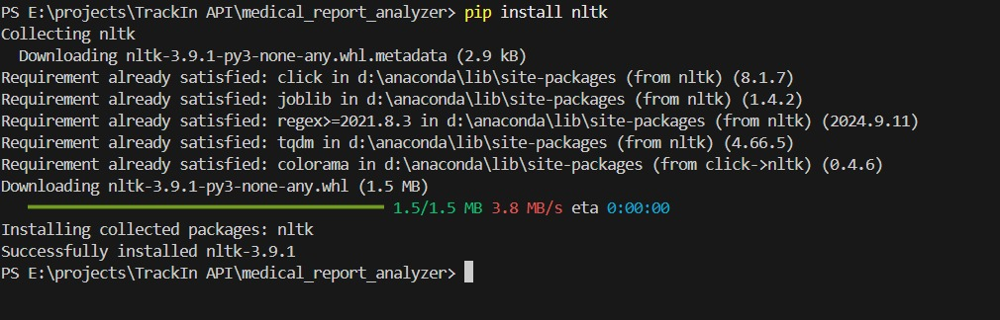
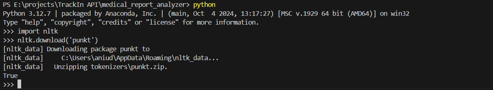
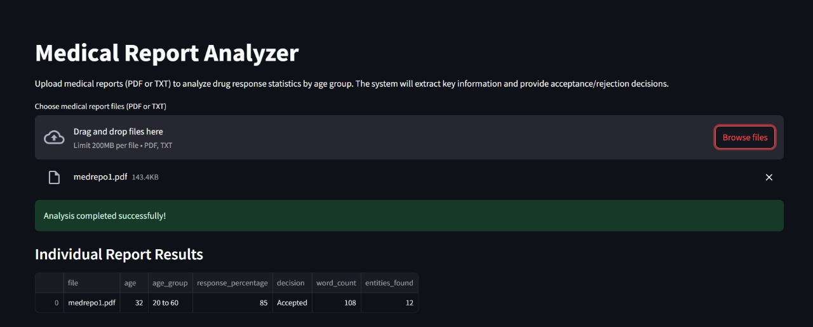
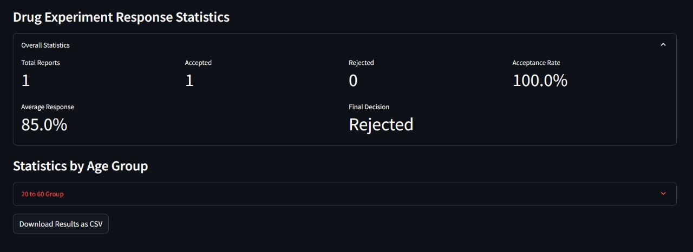

# 💊 Medicine Trial Platform

A full-stack decentralized application to manage and track medical trials securely using blockchain and machine learning.

---

## 📁 Project Structure

```

medicine-trial/
├── backend/
│   ├── contracts/
│   ├── ignition/
│   ├── models/
│   ├── scripts/
│   ├── test/
│   ├── uploads/
│   ├── app.py
│   ├── data.csv
│   ├── deployed\_contract.json
│   ├── hardhat.config.js
│   ├── index.js
│   ├── package.json
│   ├── requirements.txt
│   └── ...
├── frontend/
│   ├── src/
│   ├── public/
│   ├── angular.json
│   ├── package.json
│   └── ...
├── ai model/
│   └── app.py
└── README.md


````

---

## 🚀 Getting Started

### 📦 1. Clone the Repository

```bash
git clone https://github.com/your-username/medicine-trial.git
cd medicine-trial
````


---

## 🔙 Backend Setup (`/backend`)

### ✅ Step 1: Install Python & Node.js dependencies

```bash
cd backend
pip install -r requirements.txt
npm install
```


---


---

### ✅ Step 2: Start FastAPI server

```bash
uvicorn app:app --reload --host 0.0.0.0 --port 8000
```

Access API at: [http://localhost:8000/docs](http://localhost:8000/docs)



---

### ✅ Step 3: Deploy Smart Contract using Hardhat

```bash
npx hardhat node
npx hardhat ignition deploy ./ignition/modules/Lock.js
```

For testing:

```bash
npx hardhat test
```

(Optional: Run Ganache)

```bash
npx ganache-cli --deterministic
```





---

## 🌐 Frontend Setup (`/frontend`)

### ✅ Step 1: Install dependencies

```bash
cd ../frontend
npm install
```


---

### ✅ Step 2: Run Angular Dev Server

```bash
ng serve
```

Navigate to: [http://localhost:4200](http://localhost:4200)



---

## 🧠 ML Model Setup (`/ml-model`)

Ensure NLTK is installed and punkt tokenizer is downloaded.

```bash
pip install nltk
```

```python
import nltk
nltk.download('punkt')
```

Place model-related Python files under `/ml-model`.
## 🧠 NLP Model  (`/ml-model`)



---


### ✅ Step 3: Run Training Script

```bash
cd ai\ model/
python train_health_model.py
```

This script will:

* Generate 10,000 synthetic clinical records
* Encode labels and diagnosis categories
* Train a Random Forest Classifier
* Save the model to `health_model.pkl`

#### Sample Output:

```
Classification Report:
              precision    recall  f1-score   support

           0       0.94      0.96      0.95       988
           1       0.96      0.94      0.95      1012

    accuracy                           0.95      2000
   macro avg       0.95      0.95      0.95      2000
weighted avg       0.95      0.95      0.95      2000

Model saved as 'health_model.pkl'
Prediction: Unhealthy
```

### ✅ Step 4: Predict with Trained Model

```python
import joblib
model = joblib.load('health_model.pkl')
sample = [[78, 124, 94, 103, 56, 100, 1, 0]]  # Example input
prediction = model.predict(sample)
print("Prediction:", "Unhealthy" if prediction[0] == 1 else "Healthy")
```


---


## ✨ Features

* ✅ Smart Contract Deployment via Hardhat
* ✅ Medicine Trial Management via FastAPI
* ✅ Angular UI for interacting with APIs
* ✅ Upload and analyze trial data
* ✅ NLP-powered ML module for insights
* ✅ Decentralized backend support using Ethereum

---


## 📜 License

This project is licensed under the [MIT License](LICENSE).

---

