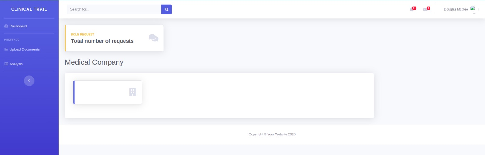
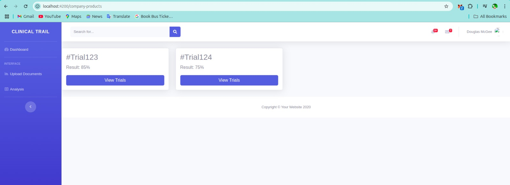
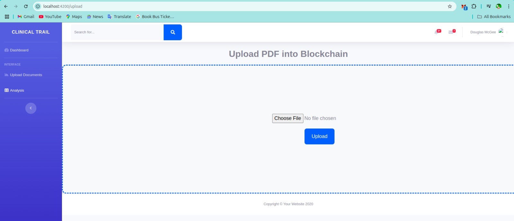
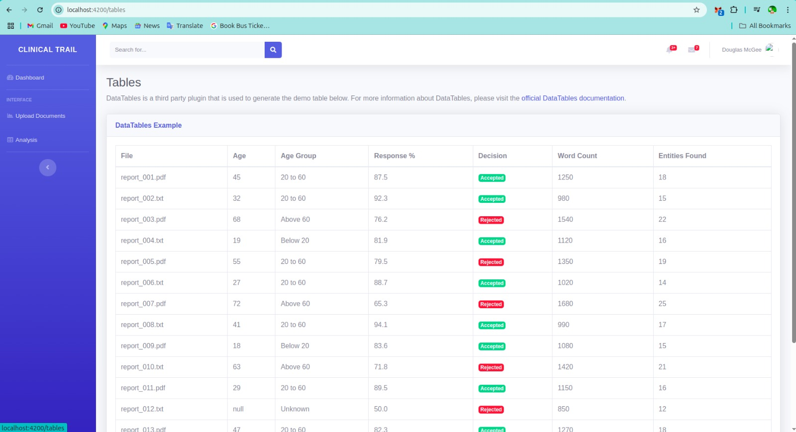
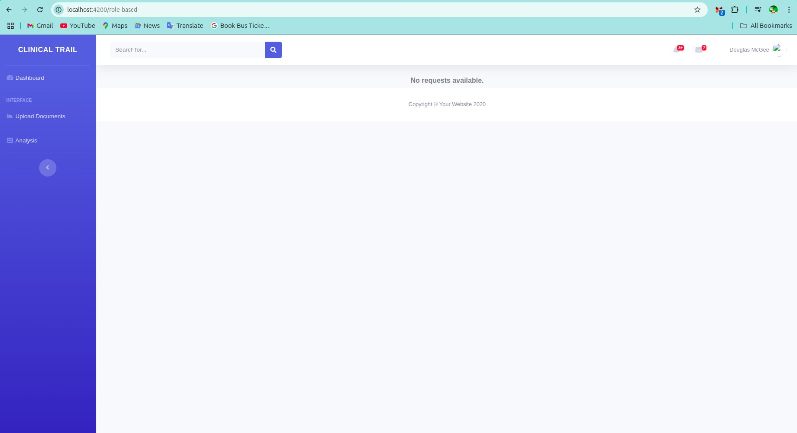

# 💊 Medicine Trial Platform

A full-stack decentralized application to manage and track medical trials securely using blockchain and machine learning.

---

## 📁 Project Structure

```

medicine-trial/
├── backend/
│   ├── contracts/
│   ├── ignition/
│   ├── models/
│   ├── scripts/
│   ├── test/
│   ├── uploads/
│   ├── app.py
│   ├── data.csv
│   ├── deployed\_contract.json
│   ├── hardhat.config.js
│   ├── index.js
│   ├── package.json
│   ├── requirements.txt
│   └── ...
├── frontend/
│   ├── src/
│   ├── public/
│   ├── angular.json
│   ├── package.json
│   └── ...
├── ai model/
│   └── app.py
└── README.md


````

---

## 🚀 Getting Started

### 📦 1. Clone the Repository

```bash
git clone https://github.com/your-username/medicine-trial.git
cd medicine-trial
````


---

## 🔙 Backend Setup (`/backend`)

### ✅ Step 1: Install Python & Node.js dependencies

```bash
cd backend
pip install -r requirements.txt
npm install
```


---


---

### ✅ Step 2: Start FastAPI server

```bash
uvicorn app:app --reload --host 0.0.0.0 --port 8000
```

Access API at: [http://localhost:8000/docs](http://localhost:8000/docs)


---

### ✅ Step 3: Deploy Smart Contract using Hardhat

```bash
npx hardhat node
npx hardhat ignition deploy ./ignition/modules/Lock.js
```

For testing:

```bash
npx hardhat test
```

(Optional: Run Ganache)

```bash
npx ganache-cli --deterministic
```


---

## 🌐 Frontend Setup (`/frontend`)

### ✅ Step 1: Install dependencies

```bash
cd ../frontend
npm install
```


---

### ✅ Step 2: Run Angular Dev Server

```bash
ng serve
```

Navigate to: [http://localhost:4200](http://localhost:4200)


### Dashboard






---

## 🧠 ML Model Setup (`/ml-model`)

Ensure NLTK is installed and punkt tokenizer is downloaded.

```bash
pip install nltk
```

```python
import nltk
nltk.download('punkt')
```

Place model-related Python files under `/ml-model`.
## 🧠 NLP Model  (`/ml-model`)


---


### ✅ Step 3: Run Training Script

```bash
cd ai\ model/
python train_health_model.py
```

This script will:

* Generate 10,000 synthetic clinical records
* Encode labels and diagnosis categories
* Train a Random Forest Classifier
* Save the model to `health_model.pkl`

#### Sample Output:

```
Classification Report:
              precision    recall  f1-score   support

           0       0.94      0.96      0.95       988
           1       0.96      0.94      0.95      1012

    accuracy                           0.95      2000
   macro avg       0.95      0.95      0.95      2000
weighted avg       0.95      0.95      0.95      2000

Model saved as 'health_model.pkl'
Prediction: Unhealthy
```

### ✅ Step 4: Predict with Trained Model

```python
import joblib
model = joblib.load('health_model.pkl')
sample = [[78, 124, 94, 103, 56, 100, 1, 0]]  # Example input
prediction = model.predict(sample)
print("Prediction:", "Unhealthy" if prediction[0] == 1 else "Healthy")
```


---


About Decision tree : Decision trees are a type of supervised learning algorithm that can be used for both classification and regression tasks

Assume this is a classification problem (e.g., predicting if a person buys a product: Yes / No), and we have the following data:

Age Group	Yes	No	Total
Below 18	2	6	8
18 to 60	9	5	14
Above 60	3	3	6

Step-by-step Gini Calculation:
1. Gini for Below 18:
𝑝
𝑦
𝑒
𝑠
=
2
8
=
0.25
,
𝑝
𝑛
𝑜
=
6
8
=
0.75
p 
yes
​
 = 
8
2
​
 =0.25,p 
no
​
 = 
8
6
​
 =0.75
𝐺
𝑖
𝑛
𝑖
=
1
−
(
0.25
2
+
0.75
2
)
=
1
−
(
0.0625
+
0.5625
)
=
0.375
Gini=1−(0.25 
2
 +0.75 
2
 )=1−(0.0625+0.5625)=0.375
2. Gini for 18 to 60:
𝑝
𝑦
𝑒
𝑠
=
9
14
,
𝑝
𝑛
𝑜
=
5
14
p 
yes
​
 = 
14
9
​
 ,p 
no
​
 = 
14
5
​
 
𝐺
𝑖
𝑛
𝑖
=
1
−
(
(
9
14
)
2
+
(
5
14
)
2
)
=
1
−
(
0.408
+
0.128
)
≈
0.464
Gini=1−(( 
14
9
​
 ) 
2
 +( 
14
5
​
 ) 
2
 )=1−(0.408+0.128)≈0.464
3. Gini for Above 60:
𝑝
𝑦
𝑒
𝑠
=
3
6
=
0.5
,
𝑝
𝑛
𝑜
=
0.5
p 
yes
​
 = 
6
3
​
 =0.5,p 
no
​
 =0.5
𝐺
𝑖
𝑛
𝑖
=
1
−
(
0.5
2
+
0.5
2
)
=
1
−
(
0.25
+
0.25
)
=
0.5
Gini=1−(0.5 
2
 +0.5 
2
 )=1−(0.25+0.25)=0.5
Final Weighted Gini of the Split:
𝐺
𝑖
𝑛
𝑖
𝑠
𝑝
𝑙
𝑖
𝑡
=
8
28
(
0.375
)
+
14
28
(
0.464
)
+
6
28
(
0.5
)
Gini 
split
​
 = 
28
8
​
 (0.375)+ 
28
14
​
 (0.464)+ 
28
6
​
 (0.5)
=
0.2857
×
0.375
+
0.5
×
0.464
+
0.2143
×
0.5
=0.2857×0.375+0.5×0.464+0.2143×0.5
≈
0.107
+
0.232
+
0.107
=
0.446
≈0.107+0.232+0.107=0.446
✅ Final Answer:
Weighted Gini Index of the age-based split = 0.446

## ✨ Features

* ✅ Smart Contract Deployment via Hardhat
* ✅ Medicine Trial Management via FastAPI
* ✅ Angular UI for interacting with APIs
* ✅ Upload and analyze trial data
* ✅ NLP-powered ML module for insights
* ✅ Decentralized backend support using Ethereum

---


## 📜 License

This project is licensed under the [MIT License](LICENSE).

---

